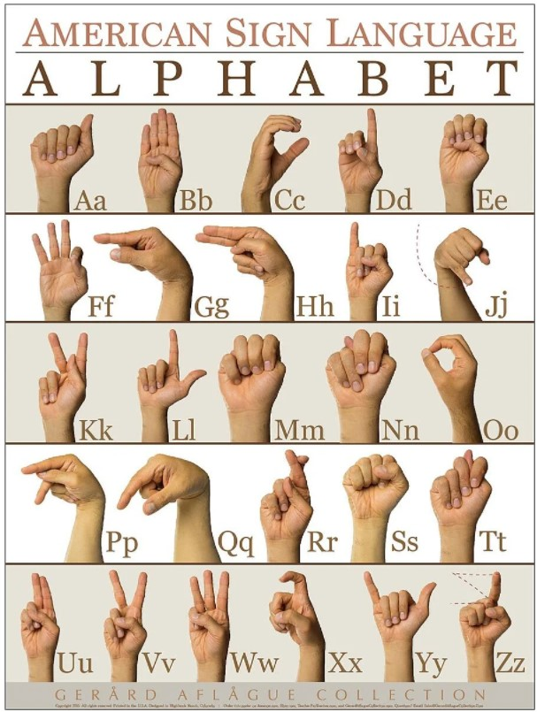
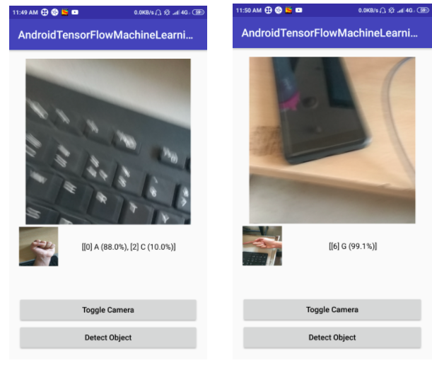

<p align="center">
  <a href="" rel="noopener">
 </a>
</p>

<h1 align="center">Sign Language Recognition App</h1>

<div align="center">
  
[](https://www.apache.org/licenses/LICENSE-2.0)

<h4>This application can recognize the sign language alphabets and help the speech and hearing impaired to communicate with those who do not understand the sign language.</h4>

</div>

-----------------------------------------
### Inspiration

* In India out of the 121 Cr population, about 51 L people suffer from disability in hearing and about 11 L people suffer from disability in speech. Most of these individuals are eager to gain education and effectively contribute to the nation building. However, all of this potential is lost as they lack the means to do so. 

* They do not even have the basic means of communicating with other people who do not know the Sign Language. As a result, they often experience many difficulties as a result of communication barriers among them and other individuals in the community. Some major areas that can be impacted by this are involvement in extracurricular activities and social relationships. 

* To assist people in communicating with the speech and hearing impaired, we developed an application to identify hand gestures that represent the sign language alphabets in real-time. This application can be installed on a mobile phone and works without an internet connection as well, thus serving as an ubiquitous communication aid. 

------------------------------------------
### Features

- `Detect object` :  On clicking 'Detect object', an image is captured which is sent as input to the model. After processing, the detected alphabet and the confidence of the detection is displayed.
- `Toggle Camera` : To switch between front camera and back camera.

------------------------------------------
### Demo
<p align="center">
    
</p>

------------------------------------------
### Installation
* For Usage
    * Download the [`Sign_Language_Recognition.apk`](./Sign_Language_Recognition.apk) and install it on your device. 
    * Grant the required permission to the app.
  
* For Development
    * Clone the repo
    ```sh
        $ git clone https://github.com/mihir-m-gandhi/Sign-Language-Recognition
    ```
    * Open `Code` folder in Android Studio.

------------------------------------------
### Authors

Mihir Gandhi - [mihir-m-gandhi](https://github.com/mihir-m-gandhi)

Hardik Chovadiya - [willyhardik](https://github.com/willyhardik/)

Amit Dave - [amitdave1998](https://github.com/amitdave1998)

------------------------------------------
### License
This project is licensed under the Apache License 2.0 - see the [LICENSE](./LICENSE) file for details.
